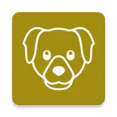

# Dogga

Simple Android Native Application consuming the [Dog API](https://dog.ceo/dog-api/)

This app is made just for portfolio and study purposes and it is in constant evolution.

It is made using:

- MVVM
- Jetpack Compose
- Retrofit
- JUnit4
- Mockk
- Kotlin DSL (kts script)
- Koin
  
